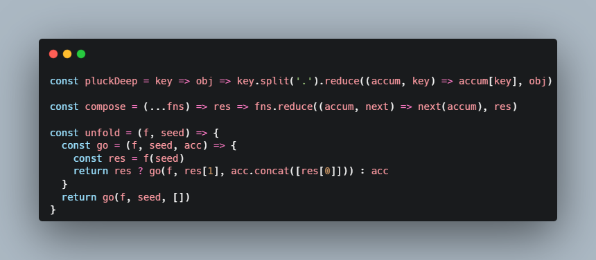
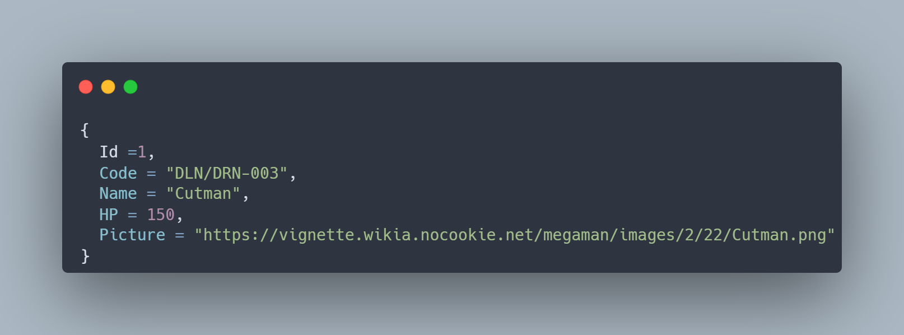

<h1 align="center">
  <br />
  
  <br />
  <b>Meu Projeto API .NET Core</b>
  <br />
  <sub
    ><sup><b>(MINHA-API-DOTNETCORE)</b></sup></sub
  >
  <br />
  <a
    href="https://github.com/seuUsuario/suaRepo/actions/workflows/build.yml"
  >
    
  </a>
  <a href="https://github.com/seuUsuario/suaRepo/releases/latest">
    
  </a>
</h1>

<p align="center">
  Este projeto de API .NET Core é projetado para servir dados formatados em JSON. É um serviço backend construído com .NET Core 3.1 e várias dependências modernas para gerenciamento de dados e manipulação de respostas da API.
  <br />
</p>

<p align="center">
  Desenvolvido com Entity Framework Core e outras tecnologias modernas .NET, este projeto visa fornecer uma API robusta para acessar dados de sua aplicação.
  <br />
</p>

<p align="center">
  <br />
  
</p>

## Resumo do Projeto

### Projeto:
Este é um projeto de API desenvolvido em .NET Core 3.1, utilizando o SDK `Microsoft.NET.Sdk.Web`. O projeto está configurado para usar o Entity Framework Core para gerenciamento de banco de dados, com suporte para o SQL Server e a biblioteca Newtonsoft.Json para manipulação de JSON.

### Estrutura do Projeto:
- **Framework Alvo**: .NET Core 3.1

### Pacotes NuGet Utilizados:
- **Microsoft.EntityFrameworkCore** (v3.1.8): Biblioteca de ORM para comunicação com o banco de dados.
- **Microsoft.EntityFrameworkCore.Design** (v3.1.8): Ferramentas de design para Entity Framework Core, necessárias para a migração e scaffold do banco de dados.
  - Inclui ativos: `runtime`, `build`, `native`, `contentfiles`, `analyzers`, `buildtransitive`
  - Todos os ativos são privados.
- **Microsoft.EntityFrameworkCore.SqlServer** (v3.1.8): Provedor SQL Server para Entity Framework Core.
- **Newtonsoft.Json** (v12.0.2): Biblioteca popular para manipulação e serialização de dados JSON.

### Descrição:
O projeto de API foi criado para ser eficiente e escalável, com uma configuração para facilitar a interação com bancos de dados SQL Server utilizando Entity Framework Core. A manipulação de dados JSON é feita de forma robusta com o uso da biblioteca Newtonsoft.Json. Este setup garante uma base sólida para o desenvolvimento de aplicações web modernas e robustas.


## API Endpoints

<h1 align="center">
  <br />
  
  <br />
  <b>Meu Projeto API .NET Core</b>
  <br />
  <sub
    ><sup><b>(MINHA-API-DOTNETCORE)</b></sup></sub
  >
  <br />
  <a
    href="https://github.com/seuUsuario/suaRepo/actions/workflows/build.yml"
  >
    
  </a>
  <a href="https://github.com/seuUsuario/suaRepo/releases/latest"> https://github.com/seuUsuario/suaRepo.git
    
  </a>
</h1>

<p align="center">
  Este projeto de API .NET Core é projetado para servir dados formatados em JSON. É um serviço backend construído com .NET Core 3.1 e várias dependências modernas para gerenciamento de dados e manipulação de respostas da API.
  <br />
</p>

<p align="center">
  Desenvolvido com Entity Framework Core e outras tecnologias modernas .NET, este projeto visa fornecer uma API robusta para acessar dados de sua aplicação.
  <br />
</p>

<p align="center">
  <br />
  
</p>

## Resumo do Projeto

### Projeto:
Este é um projeto de API desenvolvido em .NET Core 3.1, utilizando o SDK `Microsoft.NET.Sdk.Web`. O projeto está configurado para usar o Entity Framework Core para gerenciamento de banco de dados, com suporte para o SQL Server e a biblioteca Newtonsoft.Json para manipulação de JSON.

### Estrutura do Projeto:
- **Framework Alvo**: .NET Core 3.1

### Pacotes NuGet Utilizados:
- **Microsoft.EntityFrameworkCore** (v3.1.8): Biblioteca de ORM para comunicação com o banco de dados.
- **Microsoft.EntityFrameworkCore.Design** (v3.1.8): Ferramentas de design para Entity Framework Core, necessárias para a migração e scaffold do banco de dados.
  - Inclui ativos: `runtime`, `build`, `native`, `contentfiles`, `analyzers`, `buildtransitive`
  - Todos os ativos são privados.
- **Microsoft.EntityFrameworkCore.SqlServer** (v3.1.8): Provedor SQL Server para Entity Framework Core.
- **Newtonsoft.Json** (v12.0.2): Biblioteca popular para manipulação e serialização de dados JSON.

### Descrição:
O projeto de API foi criado para ser eficiente e escalável, com uma configuração para facilitar a interação com bancos de dados SQL Server utilizando Entity Framework Core. A manipulação de dados JSON é feita de forma robusta com o uso da biblioteca Newtonsoft.Json. Este setup garante uma base sólida para o desenvolvimento de aplicações web modernas e robustas.

## Endpoints da API

| Método | Endpoint                  | Descrição                                                 |
|--------|---------------------------|-----------------------------------------------------------|
| GET    | /api/v1/robots            | Retorna todos os robôs.                                   |
| GET    | /api/v1/robots/{id}       | Retorna um robô específico pelo ID.                       |
| POST   | /api/v1/robots            | Adiciona um novo robô (a ser implementado).               |

### Detalhes dos Endpoints

- **GET /api/v1/robots**
  - Retorna uma lista de todos os robôs disponíveis.

- **GET /api/v1/robots/{id}**
  - Parâmetros:
    - `id` (int): Identificador do robô.
  - Retorna um robô específico com base no ID fornecido. Caso o robô não seja encontrado, retorna uma mensagem "Nenhum robô encontrado".

- **POST /api/v1/robots**
  - Endpoint reservado para adicionar um novo robô (atualmente retorna um OK sem funcionalidade implementada).


## Techniques Used

<p align="center">
  - <b>Entity Framework Core:</b> ORM for data management.<br />
  - <b>RESTful API Design:</b> Ensures clear and effective communication
  endpoints.<br />
  - <b>Dependency Injection:</b> Used throughout to promote loose coupling and
  enhanced testability.<br />
</p>

## Dependencies

<table align="center">
  <tr>
    <th>Package</th>
    <th>Version</th>
    <th>Link</th>
  </tr>
  <tr>
    <td>Microsoft.EntityFrameworkCore</td>
    <td>3.1.8</td>
    <td>
      <a
        href="https://www.nuget.org/packages/Microsoft.EntityFrameworkCore/3.1.8"
        >NuGet</a
      >
    </td>
  </tr>
  <tr>
    <td>Microsoft.EntityFrameworkCore.Design</td>
    <td>3.1.8</td>
    <td>
      <a
        href="https://www.nuget.org/packages/Microsoft.EntityFrameworkCore.Design/3.1.8"
        >NuGet</a
      >
    </td>
  </tr>
  <tr>
    <td>Microsoft.EntityFrameworkCore.SqlServer</td>
    <td>3.1.8</td>
    <td>
      <a
        href="https://www.nuget.org/packages/Microsoft.EntityFrameworkCore.SqlServer/3.1.8"
        >NuGet</a
      >
    </td>
  </tr>
  <tr>
    <td>Newtonsoft.Json</td>
    <td>12.0.2</td>
    <td>
      <a href="https://www.nuget.org/packages/Newtonsoft.Json/12.0.2">NuGet</a>
    </td>
  </tr>
</table>

## :gear: Arch

```🌐
src
├── 📂 Controllers      [Routes for endpoints]
├── 📂 Models           [Database models]
├── 📂 Services         [Business rules]
├── 📂 Middlewares      [Intermediate functions between the HTTP request and the final server response]
├── 📂 Database         [Structures related to the database]
│   ├── 📂 DTOs             [Input Models and View Models (Data Transfer Objects)]
│   ├── 📂 EntityFramework  [Files related to the ORM Entity Framework]
│   │     ├── 📂 Context         [Entity context settings]
│   │     ├── 📂 Migrations      [Migrations for database updates]
│   ├── 📂 Repositories     [Repository pattern]
```

## License This software is licensed under the terms of the [MIT]

⌨️ HudsonCruz -
[Github](https://github.com/hcamposcruz/document_megaApi.git)
